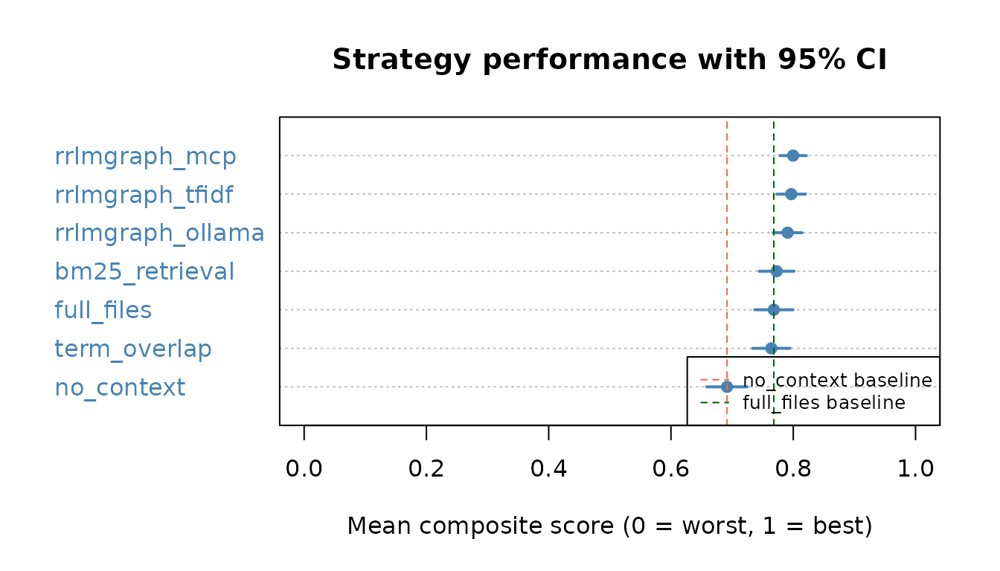
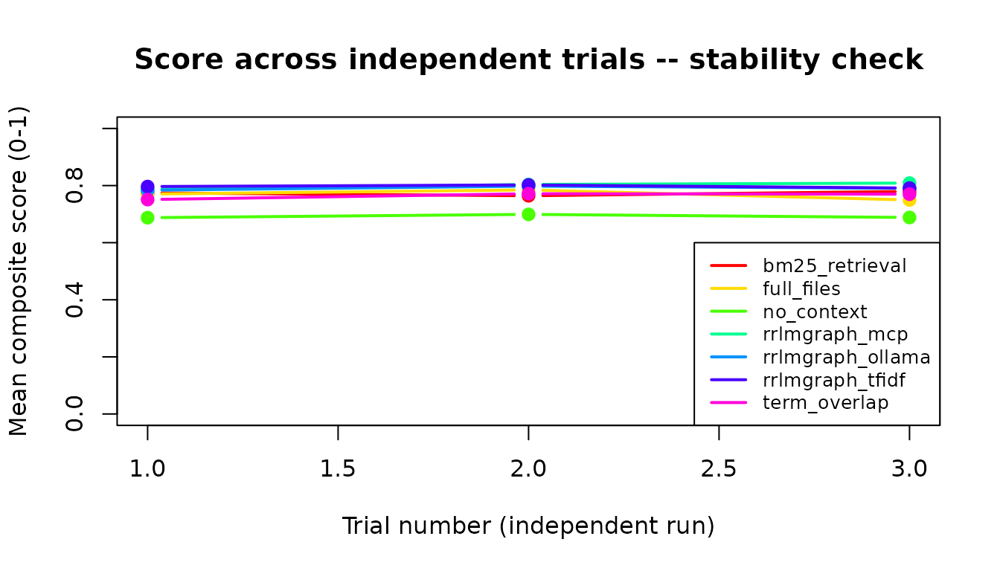

# rrlmgraph Benchmark Report

## What this benchmark measures

This vignette evaluates how well different **context-retrieval
strategies** help an LLM answer R coding tasks. The benchmark asks:

> *Given a natural-language task description and an R project, which
> retrieval strategy gives an LLM the context it needs to produce
> correct, runnable R code?*

Each strategy is judged by how often the LLM response:

1.  **Parses** as valid R syntax (`syntax_valid`)
2.  **Runs** without error when `eval(parse(...))` is called
    (`runs_without_error`)
3.  **Mentions the right functions** – the fraction of ground-truth node
    names found in the generated code (`nodes_score`)

These three components are combined into a single **composite score**
between 0 and 1:

    score = 0.25 * syntax_valid
          + 0.25 * runs_without_error
          + 0.50 * nodes_score

A score of **1.0** means the response parsed, ran, and referenced every
expected function/object. A score of **0** means it failed on all three.

------------------------------------------------------------------------

## Retrieval strategies compared

| Strategy           | How context is retrieved                                                             | Token cost                |
|--------------------|--------------------------------------------------------------------------------------|---------------------------|
| `rrlmgraph_tfidf`  | Graph traversal: PageRank hubs + TF-IDF similarity to query                          | Low – only relevant nodes |
| `rrlmgraph_ollama` | Graph traversal: PageRank hubs + Ollama vector similarity                            | Low – only relevant nodes |
| `full_files`       | Every source file in the project dumped verbatim (**upper baseline**)                | Very high                 |
| `term_overlap`     | Files ranked by word overlap with the task description (no graph)                    | Medium                    |
| `no_context`       | No code context sent – LLM must answer from training data alone (**lower baseline**) | Zero                      |
| `random_k`         | Five randomly sampled code chunks (random baseline)                                  | Low                       |

The two **baselines** to beat are:

- `no_context` – if a strategy cannot beat this, it is useless.
- `full_files` – if a strategy beats this at lower token cost, graph
  retrieval is providing genuine value.

Results are loaded from `inst/results/benchmark_results.rds`. They are
regenerated automatically every Monday (and on demand) by the
`run-benchmark` CI workflow using GitHub Models (`gpt-4o-mini`).

------------------------------------------------------------------------

## Results

``` r
results_path <- system.file(
  "results", "benchmark_results.rds",
  package = "rrlmgraphbench"
)
results_available <- file.exists(results_path)
if (!results_available) {
  message(
    "benchmark_results.rds not found.\n",
    "Trigger the run-benchmark GitHub Actions workflow to generate results,\n",
    "or run run_full_benchmark() locally with .dry_run = TRUE for a quick test."
  )
} else {
  all_results <- readRDS(results_path)
  # Drop rows where the LLM call failed (e.g. rate-limit exhaustion at end of
  # daily quota). These NA scores would propagate through statistics and plots.
  n_na <- sum(is.na(all_results$score))
  if (n_na > 0L) {
    message(n_na, " row(s) with NA score dropped (rate-limit failures).")
    all_results <- all_results[!is.na(all_results$score), ]
  }
  knitr::kable(
    head(all_results[, c(
      "task_id", "strategy", "trial", "score",
      "syntax_valid", "runs_without_error", "total_tokens"
    )], 6),
    caption = paste0(
      "First 6 rows of raw results. 'score' is the composite 0-1 metric. ",
      "'syntax_valid' and 'runs_without_error' are 0/1 indicators. ",
      "'total_tokens' is the sum of input + output tokens billed."
    )
  )
}
```

| task_id           | strategy        | trial |     score | syntax_valid | runs_without_error | total_tokens |
|:------------------|:----------------|------:|----------:|:-------------|:-------------------|-------------:|
| task_017_fm_shiny | rrlmgraph_tfidf |     1 | 0.7172388 | TRUE         | TRUE               |         1206 |
| task_017_fm_shiny | full_files      |     1 | 0.6956590 | TRUE         | TRUE               |         2361 |
| task_017_fm_shiny | term_overlap    |     1 | 0.6891128 | TRUE         | TRUE               |         5877 |
| task_017_fm_shiny | bm25_retrieval  |     1 | 0.6922215 | TRUE         | TRUE               |         5615 |
| task_017_fm_shiny | no_context      |     1 | 0.6668615 | TRUE         | TRUE               |          209 |
| task_005_bd_shiny | rrlmgraph_tfidf |     1 | 0.9152941 | TRUE         | TRUE               |          889 |

First 6 rows of raw results. ‘score’ is the composite 0-1 metric.
‘syntax_valid’ and ‘runs_without_error’ are 0/1 indicators.
‘total_tokens’ is the sum of input + output tokens billed.

------------------------------------------------------------------------

## Summary statistics

Each metric below is averaged across all tasks and trials for a given
strategy.

| Column                  | Meaning                                                                       |
|-------------------------|-------------------------------------------------------------------------------|
| `n`                     | Total trials (tasks x trials per task)                                        |
| `mean_score`            | Average composite score (0-1); higher is better                               |
| `sd_score`              | Standard deviation of per-trial scores                                        |
| `ci_lo_95` / `ci_hi_95` | 95% confidence interval for the mean score                                    |
| `mean_total_tokens`     | Average tokens consumed per trial (input + output)                            |
| `hallucination_rate`    | Fraction of trials where at least one invented function/argument was detected |

``` r
if (results_available) {
  stats <- compute_benchmark_statistics(all_results)
  knitr::kable(
    stats$summary[, c(
      "strategy", "n", "mean_score", "sd_score",
      "ci_lo_95", "ci_hi_95", "mean_total_tokens", "hallucination_rate"
    )],
    digits = 3,
    caption = "Summary: mean score, 95% CI, token usage, and hallucination rate per strategy."
  )
}
```

| strategy         |   n | mean_score | sd_score | ci_lo_95 | ci_hi_95 | mean_total_tokens | hallucination_rate |
|:-----------------|----:|-----------:|---------:|---------:|---------:|------------------:|-------------------:|
| rrlmgraph_tfidf  |  90 |      0.797 |    0.112 |    0.773 |    0.820 |           720.122 |              0.411 |
| full_files       |  90 |      0.768 |    0.149 |    0.737 |    0.799 |          1983.267 |              0.378 |
| term_overlap     |  90 |      0.764 |    0.146 |    0.734 |    0.795 |          2665.944 |              0.400 |
| bm25_retrieval   |  90 |      0.773 |    0.136 |    0.744 |    0.801 |          2288.756 |              0.433 |
| no_context       |  90 |      0.692 |    0.158 |    0.658 |    0.725 |           264.522 |              0.311 |
| rrlmgraph_ollama |  90 |      0.791 |    0.112 |    0.767 |    0.814 |           749.556 |              0.444 |
| rrlmgraph_mcp    |  90 |      0.800 |    0.103 |    0.778 |    0.821 |          1426.733 |              0.422 |

Summary: mean score, 95% CI, token usage, and hallucination rate per
strategy.

------------------------------------------------------------------------

## Score distribution (with confidence intervals)

The dot chart below shows each strategy’s mean score. Horizontal bars
are 95% confidence intervals. Strategies are sorted best-to-worst. A
strategy is significantly better than another only if the confidence
intervals do not overlap.

``` r
if (results_available) {
  summary_df <- stats$summary
  summary_df <- summary_df[order(summary_df$mean_score, decreasing = FALSE), ]
  n_s <- nrow(summary_df)
  dotchart(
    summary_df$mean_score,
    labels = summary_df$strategy,
    xlab   = "Mean composite score (0 = worst, 1 = best)",
    main   = "Strategy performance with 95% CI",
    pch    = 19,
    col    = "steelblue",
    xlim   = c(0, 1)
  )
  segments(
    x0  = summary_df$ci_lo_95,
    x1  = summary_df$ci_hi_95,
    y0  = seq_len(n_s),
    lwd = 2,
    col = "steelblue"
  )
  abline(
    v = summary_df$mean_score[summary_df$strategy == "no_context"],
    lty = 2, col = "tomato", lwd = 1
  )
  abline(
    v = summary_df$mean_score[summary_df$strategy == "full_files"],
    lty = 2, col = "darkgreen", lwd = 1
  )
  legend("bottomright",
    legend = c("no_context baseline", "full_files baseline"),
    col = c("tomato", "darkgreen"),
    lty = 2, lwd = 1, cex = 0.8
  )
}
```



------------------------------------------------------------------------

## Token Efficiency Ratio (TER)

**TER** = (strategy mean score / strategy mean tokens) / (full_files
mean score / full_files mean tokens).

A **TER \> 1** means the strategy delivers *more score per token* than
dumping the entire project. This is the key metric for assessing whether
graph-based retrieval is worth deploying in production over the
brute-force `full_files` approach.

``` r
if (results_available) {
  ter_df <- data.frame(
    strategy = names(stats$ter),
    TER = round(stats$ter, 3),
    interpretation = ifelse(
      is.na(stats$ter), "N/A (baseline)",
      ifelse(stats$ter > 1,
        "More efficient than full_files",
        "Less efficient than full_files"
      )
    )
  )
  ter_df <- ter_df[order(ter_df$TER, decreasing = TRUE, na.last = TRUE), ]
  knitr::kable(ter_df,
    row.names = FALSE,
    caption = paste0(
      "Token Efficiency Ratio (TER) vs full_files baseline. ",
      "TER > 1: strategy achieves higher score-per-token than full_files. ",
      "TER < 1: strategy is less efficient."
    )
  )
}
```

| strategy         |   TER | interpretation                 |
|:-----------------|------:|:-------------------------------|
| no_context       | 6.750 | More efficient than full_files |
| rrlmgraph_tfidf  | 2.856 | More efficient than full_files |
| rrlmgraph_ollama | 2.724 | More efficient than full_files |
| rrlmgraph_mcp    | 1.447 | More efficient than full_files |
| bm25_retrieval   | 0.872 | Less efficient than full_files |
| term_overlap     | 0.740 | Less efficient than full_files |
| full_files       |    NA | N/A (baseline)                 |

Token Efficiency Ratio (TER) vs full_files baseline. TER \> 1: strategy
achieves higher score-per-token than full_files. TER \< 1: strategy is
less efficient.

------------------------------------------------------------------------

## Hallucination analysis

A **hallucination** is any invented function name, invalid argument, or
wrong package namespace in the LLM response. Hallucinations make
generated code fail silently or with confusing errors.

``` r
if (results_available) {
  hall_df <- stats$summary[, c("strategy", "hallucination_rate")]
  hall_df$hallucination_rate <- round(hall_df$hallucination_rate, 3)
  hall_df <- hall_df[order(hall_df$hallucination_rate), ]
  hall_df$verdict <- ifelse(
    hall_df$hallucination_rate == 0, "None detected",
    ifelse(hall_df$hallucination_rate < 0.1, "Low (< 10%)",
      ifelse(hall_df$hallucination_rate < 0.25, "Moderate (10-25%)", "High (> 25%)")
    )
  )
  knitr::kable(hall_df,
    row.names = FALSE,
    caption = paste0(
      "Hallucination rate per strategy. ",
      "Defined as: fraction of trials with >= 1 invented function, ",
      "invalid argument, or wrong namespace."
    )
  )
}
```

| strategy         | hallucination_rate | verdict       |
|:-----------------|-------------------:|:--------------|
| no_context       |              0.311 | High (\> 25%) |
| full_files       |              0.378 | High (\> 25%) |
| term_overlap     |              0.400 | High (\> 25%) |
| rrlmgraph_tfidf  |              0.411 | High (\> 25%) |
| rrlmgraph_mcp    |              0.422 | High (\> 25%) |
| bm25_retrieval   |              0.433 | High (\> 25%) |
| rrlmgraph_ollama |              0.444 | High (\> 25%) |

Hallucination rate per strategy. Defined as: fraction of trials with \>=
1 invented function, invalid argument, or wrong namespace.

Hallucination type breakdown (where available):

``` r
if (results_available && "hallucination_details" %in% names(all_results)) {
  # Use keepNA = FALSE so NA entries in hallucination_details are excluded,
  # preventing NA propagation into strsplit / regmatches / barplot names.arg.
  non_empty <- !is.na(all_results$hallucination_details) &
    nzchar(all_results$hallucination_details)
  details_flat <- unlist(strsplit(all_results$hallucination_details[non_empty], "; "))
  details_flat <- details_flat[!is.na(details_flat) & nzchar(details_flat)]
  if (length(details_flat) > 0) {
    known_types <- c("invented_function", "invalid_argument", "wrong_namespace")
    type_pattern <- regmatches(
      details_flat,
      regexpr(paste(known_types, collapse = "|"), details_flat)
    )
    type_counts <- sort(table(type_pattern), decreasing = TRUE)
    # Only plot understood types; skip any unknown category gracefully.
    keep <- names(type_counts) %in% known_types
    type_counts <- type_counts[keep]
    if (length(type_counts) > 0L) {
      label_map <- c(
        invented_function = "Invented\nfunction\n(e.g. foo::bar\nthat doesn't exist)",
        invalid_argument  = "Invalid\nargument\n(e.g. wrong\nparam name)",
        wrong_namespace   = "Wrong\nnamespace\n(e.g. pkg1::fn\ninstead of pkg2::fn)"
      )
      barplot(
        type_counts,
        main = "Hallucination types across all strategies",
        ylab = "Count of occurrences",
        xlab = "Type",
        col = c("tomato", "goldenrod", "steelblue")[seq_along(type_counts)],
        names.arg = label_map[names(type_counts)]
      )
    } else {
      message("No known hallucination types detected in the loaded results.")
    }
  } else {
    message("No hallucinations detected in the loaded results.")
  }
}
#> No known hallucination types detected in the loaded results.
```

------------------------------------------------------------------------

## Pairwise statistical tests

Each pair of strategies is compared using a Welch *t*-test (robust to
unequal variance). P-values are Bonferroni-corrected for multiple
comparisons. **Cohen’s *d*** measures practical effect size: \|d\| \<
0.2 = negligible, 0.2-0.5 = small, 0.5-0.8 = medium, \> 0.8 = large.

``` r
if (results_available) {
  pw <- stats$pairwise
  if (!is.null(pw) && nrow(pw) > 0) {
    pw$sig <- ifelse(pw$p_bonferroni < 0.001, "***",
      ifelse(pw$p_bonferroni < 0.01, "**",
        ifelse(pw$p_bonferroni < 0.05, "*", "ns")
      )
    )
    pw$effect <- ifelse(abs(pw$cohens_d) < 0.2, "negligible",
      ifelse(abs(pw$cohens_d) < 0.5, "small",
        ifelse(abs(pw$cohens_d) < 0.8, "medium", "large")
      )
    )
    knitr::kable(
      pw[, c(
        "strategy_1", "strategy_2", "statistic",
        "p_value_raw", "p_bonferroni", "cohens_d", "sig", "effect"
      )],
      digits = 4,
      caption = paste0(
        "Pairwise Welch t-tests (Bonferroni-corrected). ",
        "sig: ns = not significant, * p<0.05, ** p<0.01, *** p<0.001. ",
        "effect: Cohen's d magnitude."
      )
    )
  } else {
    message("Pairwise tests require n_trials >= 2 per strategy.")
  }
}
```

| strategy_1       | strategy_2       | statistic | p_value_raw | p_bonferroni | cohens_d | sig    | effect     |
|:-----------------|:-----------------|----------:|------------:|-------------:|---------:|:-------|:-----------|
| rrlmgraph_tfidf  | full_files       |    1.4497 |      0.1491 |       1.0000 |   0.2161 | ns     | small      |
| rrlmgraph_tfidf  | term_overlap     |    1.6816 |      0.0945 |       1.0000 |   0.2507 | ns     | small      |
| rrlmgraph_tfidf  | bm25_retrieval   |    1.2841 |      0.2008 |       1.0000 |   0.1914 | ns     | negligible |
| rrlmgraph_tfidf  | no_context       |    5.1425 |      0.0000 |       0.0000 |   0.7666 | \*\*\* | medium     |
| rrlmgraph_tfidf  | rrlmgraph_ollama |    0.3578 |      0.7209 |       1.0000 |   0.0533 | ns     | negligible |
| rrlmgraph_tfidf  | rrlmgraph_mcp    |   -0.1895 |      0.8499 |       1.0000 |  -0.0282 | ns     | negligible |
| full_files       | term_overlap     |    0.1857 |      0.8529 |       1.0000 |   0.0277 | ns     | negligible |
| full_files       | bm25_retrieval   |   -0.2173 |      0.8282 |       1.0000 |  -0.0324 | ns     | negligible |
| full_files       | no_context       |    3.3378 |      0.0010 |       0.0216 |   0.4976 | \*     | small      |
| full_files       | rrlmgraph_ollama |   -1.1449 |      0.2539 |       1.0000 |  -0.1707 | ns     | negligible |
| full_files       | rrlmgraph_mcp    |   -1.6492 |      0.1011 |       1.0000 |  -0.2458 | ns     | small      |
| term_overlap     | bm25_retrieval   |   -0.4141 |      0.6793 |       1.0000 |  -0.0617 | ns     | negligible |
| term_overlap     | no_context       |    3.1931 |      0.0017 |       0.0350 |   0.4760 | \*     | small      |
| term_overlap     | rrlmgraph_ollama |   -1.3721 |      0.1719 |       1.0000 |  -0.2045 | ns     | small      |
| term_overlap     | rrlmgraph_mcp    |   -1.8915 |      0.0604 |       1.0000 |  -0.2820 | ns     | small      |
| bm25_retrieval   | no_context       |    3.6864 |      0.0003 |       0.0064 |   0.5495 | \*\*   | medium     |
| bm25_retrieval   | rrlmgraph_ollama |   -0.9619 |      0.3375 |       1.0000 |  -0.1434 | ns     | negligible |
| bm25_retrieval   | rrlmgraph_mcp    |   -1.4932 |      0.1373 |       1.0000 |  -0.2226 | ns     | small      |
| no_context       | rrlmgraph_ollama |   -4.8461 |      0.0000 |       0.0001 |  -0.7224 | \*\*\* | medium     |
| no_context       | rrlmgraph_mcp    |   -5.4283 |      0.0000 |       0.0000 |  -0.8092 | \*\*\* | large      |
| rrlmgraph_ollama | rrlmgraph_mcp    |   -0.5612 |      0.5754 |       1.0000 |  -0.0837 | ns     | negligible |

Pairwise Welch t-tests (Bonferroni-corrected). sig: ns = not
significant, \* p\<0.05, \*\* p\<0.01, \*\*\* p\<0.001. effect: Cohen’s
d magnitude.

------------------------------------------------------------------------

## Focused test: rrlmgraph strategies vs BM25 (paired Wilcoxon)

The primary research question is whether `rrlmgraph_tfidf` delivers
statistically higher scores than `bm25_retrieval` per coding task. A
**paired signed-rank test** removes between-task variance by comparing
both strategies on the same 30 tasks. Per-task scores are averaged
across trials before pairing.

- **Null hypothesis (H₀):** median difference (`rrlmgraph_tfidf` −
  `bm25`) = 0
- **Alternative (H₁):** `rrlmgraph_tfidf` \> `bm25` (one-sided)
- **Threshold:** p \< 0.05 (required to confirm the mcp#17 merge gate)

``` r
if (results_available && !is.null(stats$wilcoxon)) {
  wdf <- stats$wilcoxon
  wdf$sig <- ifelse(
    is.na(wdf$p_value), "—",
    ifelse(wdf$p_value < 0.001, "*** p<0.001",
      ifelse(wdf$p_value < 0.01, "** p<0.01",
        ifelse(wdf$p_value < 0.05, "* p<0.05", "ns (p≥0.05)")
      )
    )
  )
  knitr::kable(
    wdf[, c(
      "strategy", "reference", "V", "p_value",
      "n_pairs", "wins", "ties", "losses", "sig"
    )],
    digits = 4,
    caption = paste0(
      "One-sided paired Wilcoxon signed-rank tests: strategy > bm25_retrieval. ",
      "V = Wilcoxon statistic; wins/ties/losses count per-task score direction. ",
      "sig: *** p<0.001, ** p<0.01, * p<0.05, ns = not significant."
    )
  )
  tfidf_row <- wdf[wdf$strategy == "rrlmgraph_tfidf", , drop = FALSE]
  if (nrow(tfidf_row) == 1L && !is.na(tfidf_row$p_value)) {
    if (tfidf_row$p_value < 0.05) {
      message(
        sprintf(
          "CONFIRMED: rrlmgraph_tfidf > bm25_retrieval (p=%.4f, n=%d pairs, %d W/%d T/%d L).",
          tfidf_row$p_value, tfidf_row$n_pairs,
          tfidf_row$wins, tfidf_row$ties, tfidf_row$losses
        )
      )
    } else {
      message(
        sprintf(
          "NOT SIGNIFICANT: rrlmgraph_tfidf vs bm25_retrieval (p=%.4f, n=%d pairs). ",
          tfidf_row$p_value, tfidf_row$n_pairs
        ),
        "Increase n_trials for more statistical power."
      )
    }
  }
} else {
  message("Wilcoxon results not available (requires bm25_retrieval and task_id in results).")
}
#> NOT SIGNIFICANT: rrlmgraph_tfidf vs bm25_retrieval (p=0.1130, n=30 pairs). Increase n_trials for more statistical power.
```

------------------------------------------------------------------------

## Per-project breakdown

The benchmark uses three fixture R projects of different types. Breaking
down scores by project shows whether a strategy is robust across project
types or only works for specific ones.

| Project   | Type                | Description                                       |
|-----------|---------------------|---------------------------------------------------|
| `mini_ds` | Data science script | Small data-wrangling project with dplyr / ggplot2 |
| `shiny`   | Shiny application   | Reactive UI with server logic and modules         |
| `rpkg`    | R package           | Package with documented functions and tests       |

``` r
if (results_available && "task_id" %in% names(all_results)) {
  m <- regmatches(
    all_results$task_id,
    regexpr("mini_ds|shiny|rpkg", all_results$task_id)
  )
  all_results$project <- ifelse(
    grepl("mini_ds|shiny|rpkg", all_results$task_id), m, NA_character_
  )
  proj_summary <- aggregate(score ~ strategy + project,
    data = all_results,
    FUN = function(x) mean(x, na.rm = TRUE)
  )
  proj_wide <- reshape(proj_summary,
    idvar = "strategy",
    timevar = "project", direction = "wide"
  )
  names(proj_wide) <- gsub("score\\.", "", names(proj_wide))
  knitr::kable(
    proj_wide,
    digits = 3,
    caption = paste0(
      "Mean score per strategy per project type. ",
      "A strategy with large differences across projects is not robust."
    )
  )
}
```

| strategy         | mini_ds |  rpkg | shiny |
|:-----------------|--------:|------:|------:|
| bm25_retrieval   |   0.832 | 0.753 | 0.734 |
| full_files       |   0.839 | 0.744 | 0.722 |
| no_context       |   0.794 | 0.641 | 0.640 |
| rrlmgraph_mcp    |   0.838 | 0.763 | 0.798 |
| rrlmgraph_ollama |   0.834 | 0.747 | 0.791 |
| rrlmgraph_tfidf  |   0.850 | 0.760 | 0.780 |
| term_overlap     |   0.835 | 0.738 | 0.719 |

Mean score per strategy per project type. A strategy with large
differences across projects is not robust.

------------------------------------------------------------------------

## Score trajectory across trials

Each task is run `n_trials` times independently. If scores improve
across trials it suggests the LLM benefits from the specific context
being fed (learning effect within context window). Flat lines indicate
consistent performance; downward trends indicate instability.

``` r
if (results_available && "trial" %in% names(all_results)) {
  trial_means <- aggregate(score ~ strategy + trial,
    data = all_results,
    FUN = function(x) mean(x, na.rm = TRUE)
  )
  strategies <- unique(trial_means$strategy)
  cols <- rainbow(length(strategies))
  plot(range(trial_means$trial), c(0, 1),
    type = "n",
    xlab = "Trial number (independent run)",
    ylab = "Mean composite score (0-1)",
    main = "Score across independent trials -- stability check"
  )
  for (i in seq_along(strategies)) {
    sub <- trial_means[trial_means$strategy == strategies[i], ]
    lines(sub$trial, sub$score, col = cols[i], lwd = 2, type = "b", pch = 19)
  }
  legend("bottomright", legend = strategies, col = cols, lwd = 2, cex = 0.8)
}
```



------------------------------------------------------------------------

## Session info

``` r
sessionInfo()
#> R version 4.5.2 (2025-10-31)
#> Platform: x86_64-pc-linux-gnu
#> Running under: Ubuntu 24.04.3 LTS
#> 
#> Matrix products: default
#> BLAS:   /usr/lib/x86_64-linux-gnu/openblas-pthread/libblas.so.3 
#> LAPACK: /usr/lib/x86_64-linux-gnu/openblas-pthread/libopenblasp-r0.3.26.so;  LAPACK version 3.12.0
#> 
#> locale:
#>  [1] LC_CTYPE=C.UTF-8       LC_NUMERIC=C           LC_TIME=C.UTF-8       
#>  [4] LC_COLLATE=C.UTF-8     LC_MONETARY=C.UTF-8    LC_MESSAGES=C.UTF-8   
#>  [7] LC_PAPER=C.UTF-8       LC_NAME=C              LC_ADDRESS=C          
#> [10] LC_TELEPHONE=C         LC_MEASUREMENT=C.UTF-8 LC_IDENTIFICATION=C   
#> 
#> time zone: UTC
#> tzcode source: system (glibc)
#> 
#> attached base packages:
#> [1] stats     graphics  grDevices utils     datasets  methods   base     
#> 
#> other attached packages:
#> [1] rrlmgraphbench_0.1.2
#> 
#> loaded via a namespace (and not attached):
#>  [1] digest_0.6.39     desc_1.4.3        R6_2.6.1          fastmap_1.2.0    
#>  [5] xfun_0.56         cachem_1.1.0      knitr_1.51        htmltools_0.5.9  
#>  [9] rmarkdown_2.30    lifecycle_1.0.5   cli_3.6.5         sass_0.4.10      
#> [13] pkgdown_2.2.0     textshaping_1.0.5 jquerylib_0.1.4   systemfonts_1.3.2
#> [17] compiler_4.5.2    tools_4.5.2       ragg_1.5.1        bslib_0.10.0     
#> [21] evaluate_1.0.5    yaml_2.3.12       otel_0.2.0        jsonlite_2.0.0   
#> [25] rlang_1.1.7       fs_1.6.7          htmlwidgets_1.6.4
```
